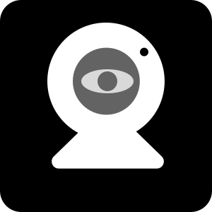
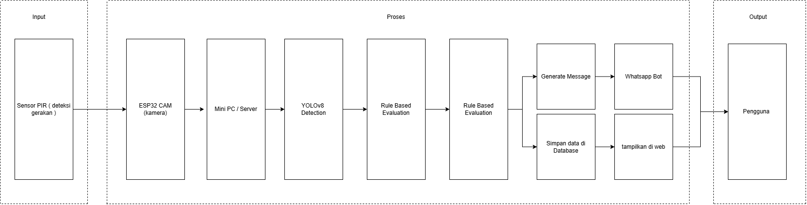
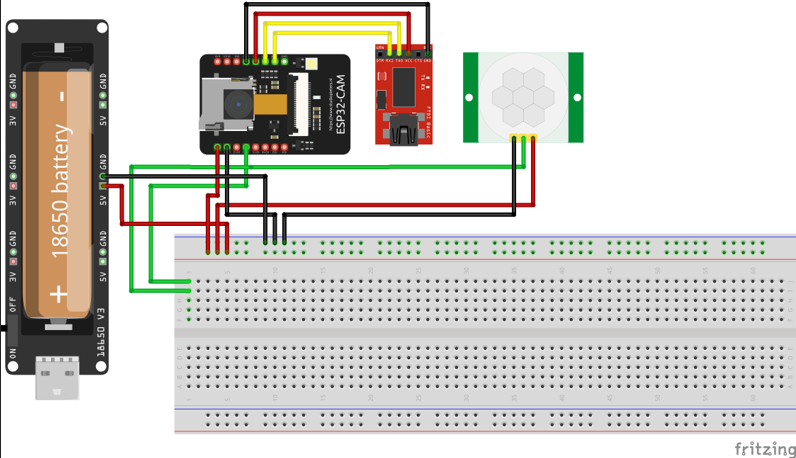
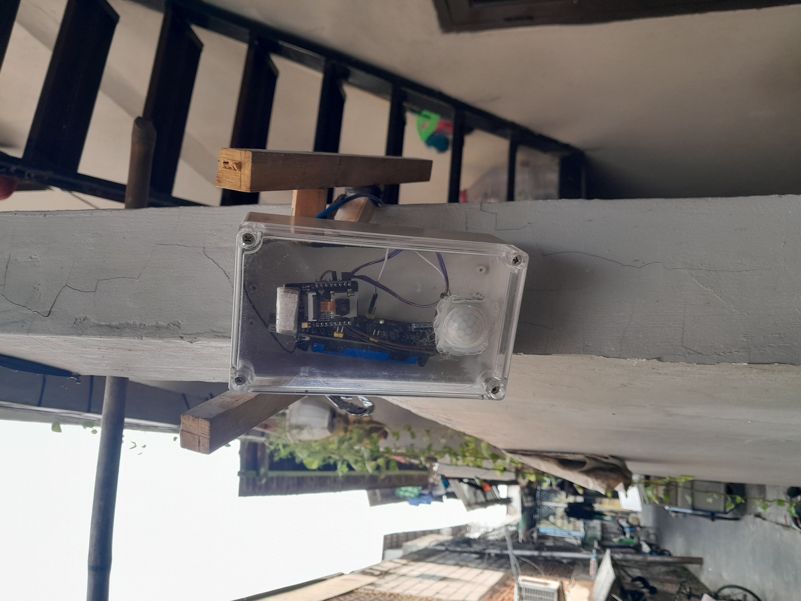
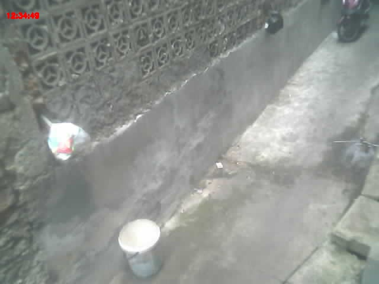
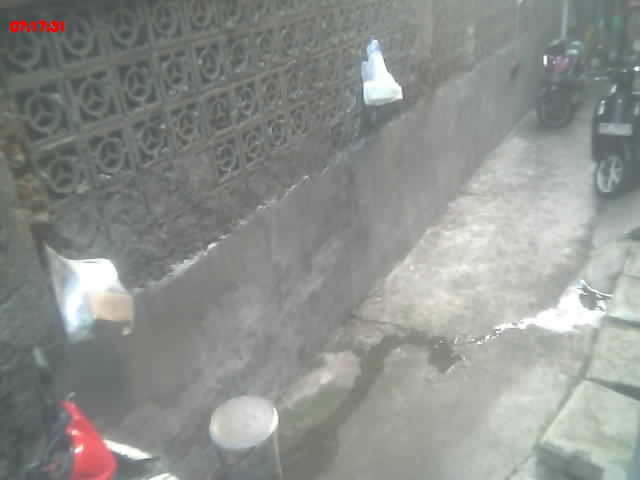
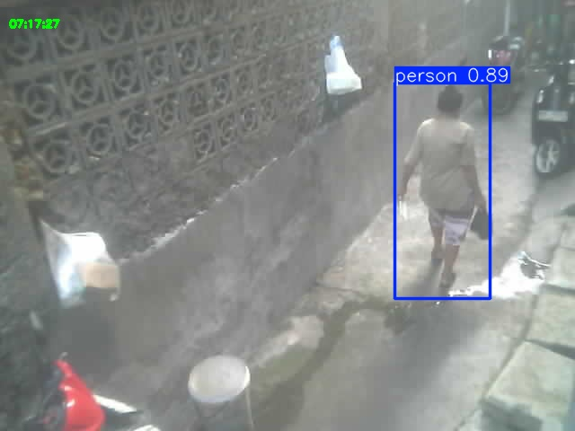
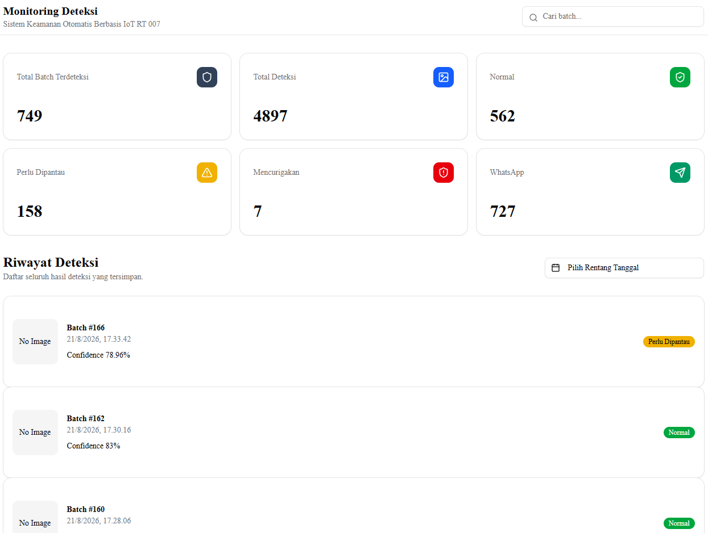
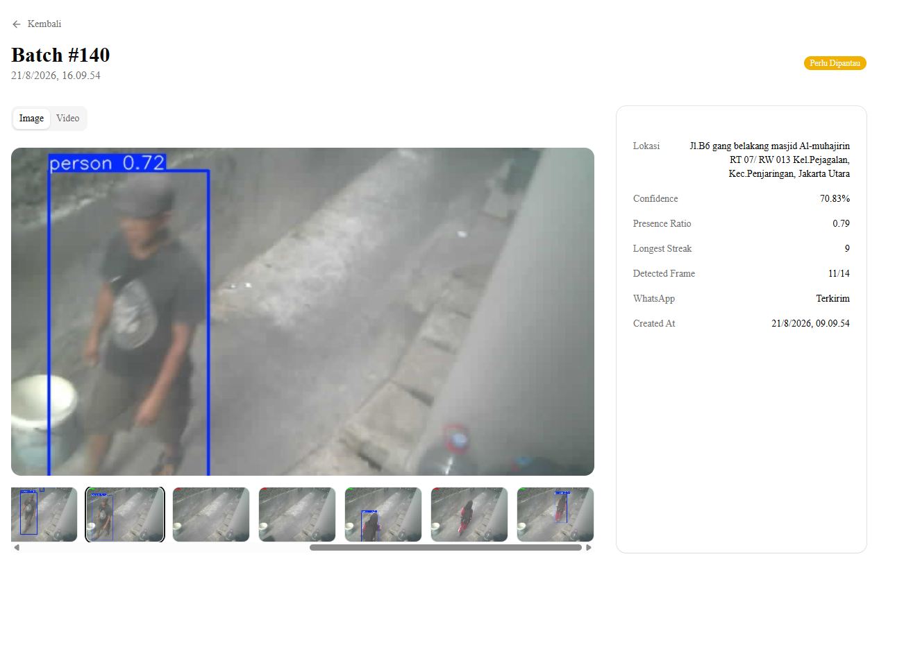

# IoT Monitoring — ESP32-CAM Smart Security System

  

<strong>Sistem monitoring keamanan berbasis ESP32-CAM, PIR, YOLOv8, dan dashboard web.</strong>

  
  
  
  
  
  
  
  
  
  

ESP32-CAM membaca gerakan dari sensor PIR, mengambil 15 frame JPEG, lalu mengirimkannya ke server. Server menjalankan deteksi manusia dengan YOLOv8 melalui OpenVINO, menyimpan hasil terkonfirmasi ke PostgreSQL, membuat video batch, dan menyediakan API serta dashboard monitoring.

## Arsitektur Sistem

1. PIR mendeteksi gerakan dan difilter dengan 5 sampel; minimal 3 sampel harus HIGH.
2. ESP32-CAM mengambil 15 frame dengan jeda 400 ms.
3. Frame dikirim melalui POST /upload, lalu batch ditutup dengan POST /upload_done.
4. Flask menjalankan YOLOv8 pada CPU/OpenVINO untuk kelas manusia (class 0).
5. Hasil batch, media, confidence, rasio kehadiran, dan status kecurigaan disimpan.
6. Dashboard membaca data dari API; batch dengan minimal 2 frame terdeteksi masuk antrean WhatsApp.

## Hardware dan Pemasangan

### Rancangan hardware IoT

Komponen inti:

- AI Thinker ESP32-CAM
- Sensor PIR pada GPIO 13
- Catu daya 5 V yang stabil
- Wi-Fi untuk koneksi ke server

### Dokumentasi pemasangan

## Hasil Uji

| Kondisi | Dokumentasi |
| --- | --- |
| Siang hari |  |
| Malam hari |  |
| Tanpa YOLO |  |
| Dengan YOLOv8 |  |

YOLOv8 memvalidasi keberadaan manusia pada setiap frame, bukan sekadar menyimpan semua gambar yang diterima kamera.

## Setup ESP32-CAM

### 1. Clone repository

~~~bash
git clone https://github.com/your-repo/ESP32CAM.git
cd ESP32CAM
~~~

### 2. Konfigurasi Wi-Fi dan server

Buat src/config.h. Jangan commit kredensial Wi-Fi.

~~~cpp
#define WIFI_SSID "your_wifissid"
#define WIFI_PASSWORD "your_wifipassword"
#define SERVER_URL "http://your_server_ip:5000"
~~~

SERVER_URL adalah alamat dasar server receiver; firmware menambahkan /upload, /upload_done, dan /heartbeat secara otomatis.

### 3. Upload firmware

Install PlatformIO pada VS Code, hubungkan ESP32-CAM, lalu jalankan:

~~~bash
pio run -t upload
pio device monitor -b 115200
~~~

PIR melakukan warm-up 30 detik. Perangkat tidur ringan ketika tidak ada gerakan dan bangun melalui PIR atau timer 10 menit.

## Setup Server

### Development laptop

~~~bash
cd server
python3.10 -m venv venv310
source venv310/bin/activate
# Windows: venv310\Scripts\activate
pip install -r requirement.txt
playwright install chromium
yolo export model=yolov8s.pt format=openvino
python receiver.py
~~~

Pastikan folder model tersedia sebagai server/yolov8m_openvino_model/ atau sesuaikan nama model di receiver.py.

### Production Ubuntu

~~~bash
sudo apt update
sudo apt install python3.10-venv ffmpeg xvfb libgl1 libglib2.0-0 -y
cd server
python3.10 -m venv venv
source venv/bin/activate
pip install -r requirement.txt gunicorn
playwright install chromium
sudo venv/bin/playwright install-deps chromium
~~~

Login WhatsApp pada server headless:

~~~bash
xvfb-run python3 login_manual.py
scp user@ip_address:~/ESP32CAM/server/qr_scan.png .
~~~

Jalankan receiver dengan satu worker:

~~~bash
PYTHONUNBUFFERED=1 xvfb-run --auto-servernum \
  gunicorn -w 1 --threads 4 --timeout 120 \
  -b 0.0.0.0:5000 receiver:app
~~~

Jika firewall memblokir port lokal:

~~~bash
sudo ufw allow 5000
~~~

## Setup Dashboard

~~~bash
cd monitoring
npm install
~~~

Buat .env.local:

~~~env
NEXT_PUBLIC_API_URL=https://api-monitor.fhanafii.my.id
~~~

Jalankan lokal dengan npm run dev. Buka http://localhost:3000. Dashboard produksi tersedia di https://monitoring.fhanafii.my.id/.

Detail media dan hasil satu batch:

## API dan Swagger

Dokumentasi interaktif tersedia di [Swagger UI](https://api-monitor.fhanafii.my.id/). Root API diarahkan ke /apidocs/.

| Method | Endpoint | Keterangan |
| --- | --- | --- |
| GET | /api/dashboard | Statistik ringkasan dashboard |
| GET | /api/detections | Daftar deteksi dengan pagination dan filter |
| GET | /api/detections/{id} | Detail deteksi dan media |
| GET | /api/detections/{id}/files | Daftar file batch |
| GET | /api/files/{path} | Mengambil gambar atau video |
| POST | /upload | Receiver menerima JPEG frame |
| POST | /upload_done | Memproses seluruh batch |
| POST | /heartbeat | Memperbarui status perangkat |
| GET | /status | Status ESP32-CAM dan batch |

Parameter GET /api/detections: page, limit (maksimal 50), status, start, end, dan keyword.

## Cara Kerja

Hasil batch disimpan sebagai frame beranotasi (*_detected.jpg atau *_undetected.jpg), video MP4, dan log.txt. Batch dicatat ke database hanya jika minimal dua frame mendeteksi manusia. Status kecurigaan dihitung dari rasio kehadiran, streak terpanjang, confidence YOLO, dan waktu deteksi malam hari.

## Catatan

- ESP32-CAM dan server harus dapat saling menjangkau melalui jaringan.
- Python 3.10 dipertahankan untuk kompatibilitas OpenVINO dan Playwright.
- Gunakan -w 1 pada Gunicorn karena worker WhatsApp menyimpan session browser.
- xvfb-run diperlukan pada server headless untuk Playwright.
- Jangan menyimpan config.h, .env.local, session WhatsApp, atau kredensial database ke repository.

## Author

Dikembangkan oleh **Fhanafii**.
